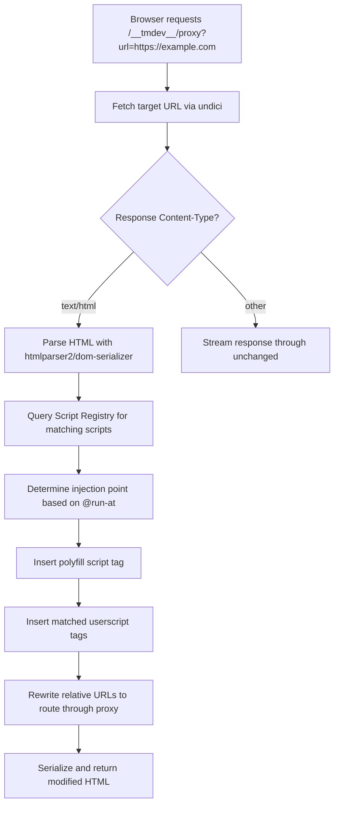
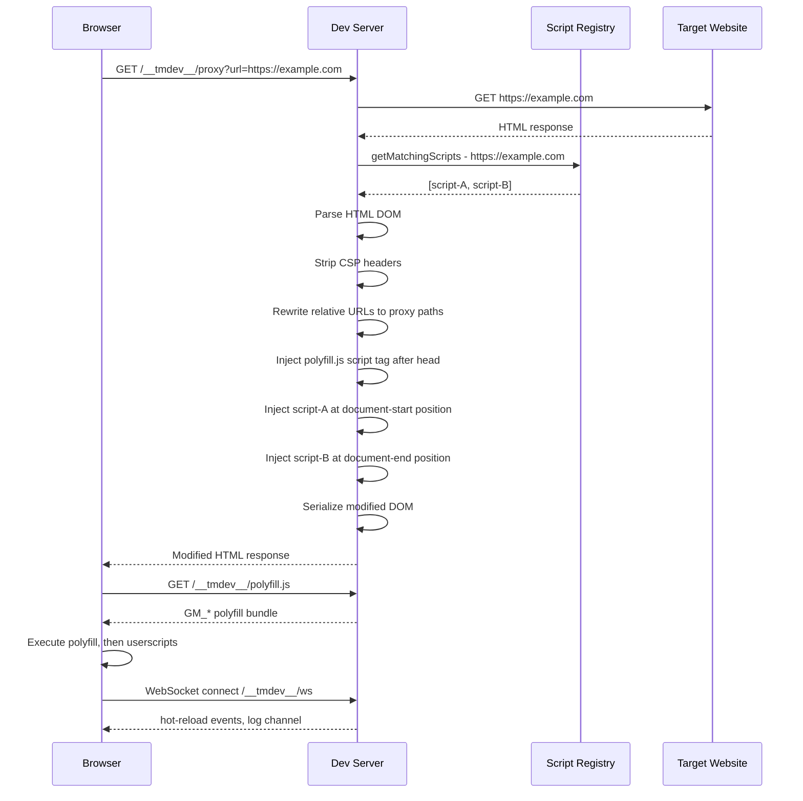

# TamperMonkey Dev Testing Service -- Architecture Document

## 1. Overview

The TamperMonkey Dev Testing Service (codename **tmdev**) is a local Node.js development tool that lets developers author, test, and debug TamperMonkey/Greasemonkey userscripts without installing them in a browser extension. It provides a proxy server that injects scripts into target pages, a polyfill layer for the GM_* API surface, a file watcher for hot-reload, and a dashboard UI for managing scripts and inspecting state.

---

## 2. High-Level System Diagram

```
+-------------------------------------------------------------+
|                        Developer Machine                     |
|                                                              |
|  +------------------+    +-------------------------------+   |
|  | .user.js files   |    |        tmdev CLI              |   |
|  | in script dirs   |--->|  (entry point / config)       |   |
|  +------------------+    +------+------------------------+   |
|                                 |                            |
|                    +------------+------------+                |
|                    |                         |                |
|              +-----v------+          +------v-------+        |
|              | File Watcher|          | Dev Server   |        |
|              | (chokidar)  |          | (Fastify)    |        |
|              +-----+------+          +--+-----------++        |
|                    |                    |            |         |
|                    | change events      |            |         |
|                    v                    v            v         |
|              +-----------+    +---------+--+ +------+------+  |
|              | Script    |    | Proxy      | | Dashboard   |  |
|              | Registry  |<---| Handler    | | UI (SPA)    |  |
|              +-----------+    | (http-     | +------+------+  |
|                    |          |  proxy-    |        |         |
|                    |          |  middleware)| WebSocket       |
|                    v          +-----+------+ (ws for HMR     |
|              +-----------+         |          + logs)         |
|              | Metadata  |         v                          |
|              | Parser    |   +------------+                   |
|              +-----------+   | Injection  |                   |
|                              | Engine     |                   |
|                              +-----+------+                   |
|                                    |                          |
|                                    v                          |
|                              +------------+                   |
|                              | GM_* Poly- |                   |
|                              | fill Bundle|                   |
|                              +------------+                   |
+-------------------------------------------------------------+
                                    |
                                    | proxied HTTP
                                    v
                          +-------------------+
                          | Target Website    |
                          | (e.g. github.com) |
                          +-------------------+
```

### Data Flow Summary

```
Browser --[request]--> Dev Server (localhost:8432)
    |
    +--> if path matches /__tmdev__/*  --> serve Dashboard UI / API
    |
    +--> if path matches /__tmdev__/proxy?url=X  --> Proxy Handler
              |
              +--> fetch target URL
              +--> parse response HTML
              +--> match URL against script @match/@include rules
              +--> inject GM_* polyfill <script> tag
              +--> inject matched userscripts <script> tags
              +--> return modified HTML to browser
```

---

## 3. Component Breakdown

### 3.1 CLI Layer (`src/cli/`)

**Responsibility:** Parse command-line arguments, load configuration, bootstrap all services.

| Concern | Detail |
|---------|--------|
| Argument parsing | Script directory paths, port, config file path, verbosity |
| Config loading | Merge CLI args with `tmdev.config.json` defaults |
| Service orchestration | Start file watcher, dev server, and open dashboard |

### 3.2 Metadata Parser (`src/core/metadata-parser.ts`)

**Responsibility:** Extract and validate the TamperMonkey metadata block from `==UserScript==` headers.

**Parsed fields:**

| Field | Type | Notes |
|-------|------|-------|
| `@name` | `string` | Script display name |
| `@namespace` | `string` | Script namespace URI |
| `@version` | `string` | Semver string |
| `@description` | `string` | Human-readable description |
| `@match` | `string[]` | URL match patterns (Chrome match pattern syntax) |
| `@include` | `string[]` | URL glob/regex patterns |
| `@exclude` | `string[]` | URL exclusion patterns |
| `@require` | `string[]` | External JS URLs to load before script |
| `@resource` | `Record<string, string>` | Named resource URLs |
| `@grant` | `string[]` | Requested GM_* permissions |
| `@run-at` | `enum` | `document-start`, `document-end`, `document-idle` |
| `@noframes` | `boolean` | Skip execution in iframes |
| `@connect` | `string[]` | Allowed domains for `GM_xmlhttpRequest` |

**Matching algorithm:** The parser exposes a `matchesURL(url: string): boolean` method per script that evaluates `@match` and `@include` patterns against a target URL, respecting `@exclude` rules. Match patterns follow the [Chrome match pattern spec](https://developer.chrome.com/docs/extensions/develop/concepts/match-patterns) and `@include` supports glob syntax with `*` and TamperMonkey regex patterns wrapped in `/regex/`.

### 3.3 Script Registry (`src/core/script-registry.ts`)

**Responsibility:** Central store for all discovered userscripts, their parsed metadata, source code, and enabled/disabled state.

```
interface ScriptEntry:
    id: string              // deterministic hash of file path
    filePath: string        // absolute path to .user.js file
    metadata: Metadata      // parsed metadata object
    source: string          // raw script source
    enabled: boolean        // toggle state, persisted
    lastModified: number    // fs mtime for change detection
```

The registry:
- Scans configured directories for `*.user.js` files on startup
- Maintains an in-memory map of `ScriptEntry` objects
- Emits events on add/remove/change via an `EventEmitter`
- Exposes `getMatchingScripts(url: string): ScriptEntry[]`

### 3.4 File Watcher (`src/core/file-watcher.ts`)

**Responsibility:** Monitor script directories for file changes and update the Script Registry.

- Uses `chokidar` to watch `**/*.user.js` glob patterns
- On file add/change: re-parse metadata, update registry, emit `script:changed` event
- On file unlink: remove from registry, emit `script:removed` event
- Change events propagate to connected WebSocket clients for hot-reload

### 3.5 Dev Server (`src/server/`)

**Responsibility:** HTTP server providing the proxy, API endpoints, dashboard UI, and WebSocket connections.

Built on **Fastify** with the following route groups:

| Route prefix | Handler | Purpose |
|--------------|---------|---------|
| `/__tmdev__/api/*` | REST API | Script management, config, storage inspection |
| `/__tmdev__/dashboard/*` | Static files | Dashboard SPA |
| `/__tmdev__/ws` | WebSocket | Hot-reload signals, live console log streaming |
| `/__tmdev__/polyfill.js` | JS bundle | GM_* polyfill library |
| `/__tmdev__/proxy` | Proxy handler | Fetch, transform, and serve proxied pages |
| `/__tmdev__/sandbox` | HTML page | iframe-based sandbox mode |

### 3.6 Proxy Handler (`src/server/proxy-handler.ts`)

**Responsibility:** Fetch a target URL, rewrite the HTML response to inject polyfills and userscripts.

**Flow:**



**URL rewriting strategy:** All relative and absolute URLs in `href`, `src`, `action` attributes are rewritten to route through the proxy. For example, `https://cdn.example.com/style.css` becomes `/__tmdev__/proxy?url=https%3A%2F%2Fcdn.example.com%2Fstyle.css`. This ensures sub-resources also flow through the dev server, maintaining CORS compatibility and allowing further injection if needed.

**CSP handling:** The proxy strips `Content-Security-Policy` and `Content-Security-Policy-Report-Only` headers from proxied responses to allow script injection. A warning is logged when CSP headers are removed.

### 3.7 Injection Engine (`src/server/injection-engine.ts`)

**Responsibility:** Generate the `<script>` tags to inject into proxied HTML based on `@run-at` timing.

| `@run-at` value | Injection point |
|-----------------|-----------------|
| `document-start` | Immediately after `<head>` opening tag |
| `document-end` | Immediately before `</body>` closing tag |
| `document-idle` | Before `</body>` with a `requestIdleCallback` wrapper |

Each injected script is wrapped in an IIFE that receives the GM_* API object scoped to that specific script instance, preventing cross-script pollution.

### 3.8 GM_* Polyfill Bundle (`src/polyfill/`)

**Responsibility:** Browser-side JavaScript library that implements the TamperMonkey/Greasemonkey API surface.

Detailed in Section 7 below.

### 3.9 Dashboard UI (`src/dashboard/`)

**Responsibility:** Single-page web application for managing the dev environment.

**Panels:**

| Panel | Description |
|-------|-------------|
| Script List | Table of discovered scripts with name, version, match patterns, enabled toggle |
| Target URL Bar | Input field + Go button to load a target URL through the proxy |
| Proxy Viewport | iframe displaying the proxied page |
| Console Output | Live log viewer receiving messages via WebSocket |
| Storage Inspector | Tree view of GM_getValue/GM_setValue data per script |
| Script Detail | Metadata viewer, dependency list, match pattern tester |

---

## 4. Project Directory Structure

```
tampermonkey-tester/
+-- package.json
+-- tsconfig.json
+-- tmdev.config.json              # default configuration
+-- docs/
|   +-- ARCHITECTURE.md            # this document
+-- src/
|   +-- index.ts                   # main entry point
|   +-- cli/
|   |   +-- index.ts               # CLI argument parsing and bootstrap
|   |   +-- options.ts             # CLI option definitions
|   +-- core/
|   |   +-- metadata-parser.ts     # ==UserScript== block parser
|   |   +-- match-pattern.ts       # @match pattern compiler and matcher
|   |   +-- include-pattern.ts     # @include glob/regex pattern matcher
|   |   +-- script-registry.ts     # in-memory script store
|   |   +-- file-watcher.ts        # chokidar-based file watcher
|   |   +-- config.ts              # configuration schema and loader
|   |   +-- types.ts               # shared TypeScript interfaces
|   +-- server/
|   |   +-- index.ts               # Fastify server setup and plugin registration
|   |   +-- proxy-handler.ts       # target URL fetching and HTML rewriting
|   |   +-- injection-engine.ts    # script tag generation and insertion
|   |   +-- api-routes.ts          # REST API route handlers
|   |   +-- websocket.ts           # WebSocket server for HMR and logs
|   |   +-- static.ts              # static file serving for dashboard
|   +-- polyfill/
|   |   +-- index.ts               # polyfill bundle entry point
|   |   +-- gm-storage.ts          # GM_getValue/setValue/deleteValue/listValues
|   |   +-- gm-xhr.ts              # GM_xmlhttpRequest implementation
|   |   +-- gm-style.ts            # GM_addStyle
|   |   +-- gm-notification.ts     # GM_notification
|   |   +-- gm-clipboard.ts        # GM_setClipboard
|   |   +-- gm-resource.ts         # GM_getResourceText/GM_getResourceURL
|   |   +-- gm-menu.ts             # GM_registerMenuCommand
|   |   +-- gm-tab.ts              # GM_openInTab
|   |   +-- gm-log.ts              # GM_log
|   |   +-- gm4-api.ts             # Promise-based GM.getValue/GM.setValue
|   |   +-- unsafe-window.ts       # unsafeWindow reference
|   |   +-- factory.ts             # per-script API instance factory
|   +-- dashboard/
|       +-- index.html             # SPA shell
|       +-- app.ts                 # dashboard application entry
|       +-- components/
|       |   +-- script-list.ts     # script listing panel
|       |   +-- target-bar.ts      # URL input bar
|       |   +-- proxy-viewport.ts  # iframe viewport
|       |   +-- console-panel.ts   # log viewer
|       |   +-- storage-inspector.ts # GM storage tree view
|       +-- styles/
|           +-- main.css           # dashboard styles
+-- scripts/                       # example userscripts for testing
|   +-- example.user.js
+-- test/
|   +-- core/
|   |   +-- metadata-parser.test.ts
|   |   +-- match-pattern.test.ts
|   |   +-- include-pattern.test.ts
|   |   +-- script-registry.test.ts
|   +-- server/
|   |   +-- proxy-handler.test.ts
|   |   +-- injection-engine.test.ts
|   |   +-- api-routes.test.ts
|   +-- polyfill/
|       +-- gm-storage.test.ts
|       +-- gm-xhr.test.ts
+-- .gitignore
+-- .gitattributes
+-- README.md
```

---

## 5. Technology Choices

| Concern | Choice | Justification |
|---------|--------|---------------|
| Runtime | Node.js 18+ | LTS with native fetch, stable ESM support, built-in test runner |
| Language | TypeScript 5.x | Type safety, better tooling, IDE support |
| HTTP server | Fastify | Fast, plugin-based, built-in schema validation, first-class TypeScript support. Lower overhead than Express. |
| HTTP client (proxy) | undici | Node.js native HTTP client, fast, supports streaming, ships with Node 18+ |
| HTML parsing | htmlparser2 + dom-serializer | Fastest HTML parser for Node.js, tolerant of malformed HTML, streaming capable. Used for rewriting proxied pages. |
| File watching | chokidar | De facto standard, cross-platform, handles Windows quirks well |
| WebSocket | ws | Minimal, fast, well-tested WebSocket library. Integrates with Fastify via @fastify/websocket. |
| CLI parsing | citty | Lightweight, modern CLI framework. Alternatively commander if more features needed. |
| Bundler (polyfill) | esbuild | Extremely fast bundling of the polyfill into a single browser-ready JS file. Also used for dashboard build. |
| Dashboard UI | Vanilla TS + lit-html | Minimal dependency. lit-html provides efficient template rendering without a full framework. Dashboard is simple enough to avoid React/Vue overhead. |
| Testing | vitest | Fast, TypeScript-native, compatible with Node.js built-in assertions |
| Linting | eslint + @typescript-eslint | Standard TypeScript linting |

### Why not Puppeteer/Playwright?

A headless browser approach was considered but rejected for this phase because:
- It adds significant binary dependencies (~400MB+)
- The proxy approach works with the developer's real browser with their existing extensions, bookmarks, and sessions
- Puppeteer is better suited for automated testing, not interactive development
- Can be added as an optional enhancement later for CI/headless testing

---

## 6. Data Flow: Request Proxying and Script Injection

### 6.1 Full Request Lifecycle



### 6.2 Sub-Resource Handling

Non-HTML resources (CSS, JS, images, fonts) requested through the proxy are streamed through unchanged with appropriate CORS headers added. The proxy sets:

```
Access-Control-Allow-Origin: *
Access-Control-Allow-Methods: GET, POST, PUT, DELETE, OPTIONS
Access-Control-Allow-Headers: *
```

### 6.3 Sandbox Mode (Alternative)

For cases where full proxy rewriting is too invasive, a sandbox mode is offered:

```
/__tmdev__/sandbox?url=https://example.com
```

This serves a host page containing:
1. The GM_* polyfill loaded in the parent frame
2. An `<iframe>` loading the target URL directly (not proxied)
3. Script injection via `iframe.contentDocument` manipulation (same-origin only) or via a service worker registered for the iframe's scope

Sandbox mode is simpler but limited to same-origin targets or targets that don't set `X-Frame-Options`.

---

## 7. GM_* Polyfill Implementation Strategy

The polyfill is a single JavaScript bundle (`polyfill.js`) built by esbuild from the `src/polyfill/` sources. It runs in the browser context of the proxied page.

### 7.1 Architecture

```
+------------------------------------------+
|  polyfill.js (browser bundle)            |
|                                          |
|  +------------------------------------+  |
|  | GM API Factory                     |  |
|  | Creates per-script API instances   |  |
|  | Scopes storage by script @name     |  |
|  +----+-------------------------------+  |
|       |                                  |
|  +----v----+ +----------+ +-----------+  |
|  | Storage | | XHR      | | Style     |  |
|  | Module  | | Module   | | Module    |  |
|  +---------+ +----------+ +-----------+  |
|  +----------+ +----------+ +----------+  |
|  | Notify   | | Clipboard| | Resource |  |
|  | Module   | | Module   | | Module   |  |
|  +----------+ +----------+ +----------+  |
|  +----------+ +----------+ +----------+  |
|  | Menu Cmd | | Tab      | | Log      |  |
|  | Module   | | Module   | | Module   |  |
|  +----------+ +----------+ +----------+  |
+------------------------------------------+
```

### 7.2 Per-Module Implementation Details

#### GM_getValue / GM_setValue / GM_deleteValue / GM_listValues

**Storage backend:** `localStorage` keyed by script name prefix.

```
Key format: __tmdev__:{scriptName}:{userKey}
```

Values are JSON-serialized. The storage module also mirrors writes to the dev server via a REST API call (`POST /__tmdev__/api/storage/{scriptId}`) so the Storage Inspector in the dashboard has visibility. The server persists storage to a JSON file on disk for durability across restarts.

Two-tier approach:
- **Synchronous API** (`GM_getValue`, `GM_setValue`): Uses `localStorage` for immediate sync access
- **Async API** (`GM.getValue`, `GM.setValue`): Returns Promises, also backed by `localStorage` but can optionally sync with server

#### GM_xmlhttpRequest

Cross-origin requests cannot be made directly from the browser due to CORS. The polyfill routes these through the dev server:

```
Browser polyfill --POST--> /__tmdev__/api/xhr
                           { method, url, headers, data, ... }
                           
Server executes the actual HTTP request via undici
                           
Server --response--> Browser polyfill
                     { status, responseHeaders, responseText, ... }
```

Streaming responses (`onprogress`) are handled via a chunked transfer encoding response or a ReadableStream.

The `@connect` metadata field is enforced server-side: the XHR proxy endpoint checks the target domain against the script's `@connect` whitelist before executing the request.

#### GM_addStyle

Injects a `<style>` element into `document.head` with the provided CSS text. Returns a reference to the created element for later removal.

```typescript
function GM_addStyle(css: string): HTMLStyleElement
```

#### GM_notification

Uses the browser's `Notification` API. Falls back to a custom toast notification overlay if `Notification.permission` is denied or unavailable.

```typescript
function GM_notification(details: {
    text: string;
    title?: string;
    image?: string;
    onclick?: () => void;
    ondone?: () => void;
}): void
```

#### GM_setClipboard

Uses `navigator.clipboard.writeText()` with fallback to `document.execCommand('copy')` via a temporary textarea.

#### GM_getResourceText / GM_getResourceURL

Resources declared in `@resource` are pre-fetched by the dev server at script load time. The polyfill receives resource data as a JSON map injected alongside the script:

```javascript
__tmdev_resources__['scriptName'] = {
    'resourceName': { text: '...', blobUrl: 'blob:...' }
};
```

- `GM_getResourceText(name)` returns the text content
- `GM_getResourceURL(name)` returns a `blob:` URL created from the fetched content

#### GM_registerMenuCommand

Registers commands in an in-memory map. The dashboard UI displays registered menu commands and allows invoking them via the WebSocket channel.

```typescript
function GM_registerMenuCommand(caption: string, onClick: () => void, accessKey?: string): number
```

#### GM_openInTab

Opens a new browser tab/window via `window.open()`. Optionally routes through the proxy if the `active` parameter indicates the tab should also have scripts injected.

#### GM_log

Wraps `console.log()` and additionally sends the message to the dev server via WebSocket for display in the dashboard console panel.

#### unsafeWindow

In a real TamperMonkey environment, `unsafeWindow` provides access to the page's actual `window` object outside the sandbox. Since our polyfill runs directly in the page context (no sandbox), `unsafeWindow` is simply a reference to `window`:

```typescript
const unsafeWindow = window;
```

### 7.3 GM4 Promise-Based API

The `GM` object (GM4 API) wraps the synchronous `GM_*` functions in Promises:

```typescript
const GM = {
    getValue: (key, defaultValue) => Promise.resolve(GM_getValue(key, defaultValue)),
    setValue: (key, value) => Promise.resolve(GM_setValue(key, value)),
    deleteValue: (key) => Promise.resolve(GM_deleteValue(key)),
    listValues: () => Promise.resolve(GM_listValues()),
    xmlHttpRequest: (details) => /* returns Promise wrapping GM_xmlhttpRequest */,
    notification: (details) => /* returns Promise wrapping GM_notification */,
    setClipboard: (data, type) => Promise.resolve(GM_setClipboard(data, type)),
    getResourceUrl: (name) => Promise.resolve(GM_getResourceURL(name)),
    openInTab: (url, options) => Promise.resolve(GM_openInTab(url, options)),
};
```

### 7.4 Grant-Based API Filtering

The factory function that creates per-script API instances respects the `@grant` metadata. If a script declares `@grant GM_setValue`, only `GM_setValue` is exposed. If `@grant none` is declared, no GM_* APIs are injected and the script runs with raw page context. If no `@grant` is specified, all APIs are available (matching TamperMonkey's default behavior).

---

## 8. API Design: Dev Server Endpoints

### 8.1 REST API (`/__tmdev__/api/`)

#### Scripts

| Method | Path | Description |
|--------|------|-------------|
| `GET` | `/api/scripts` | List all discovered scripts with metadata |
| `GET` | `/api/scripts/:id` | Get single script details including source |
| `PATCH` | `/api/scripts/:id` | Update script properties (e.g., `enabled` toggle) |
| `GET` | `/api/scripts/:id/source` | Get raw script source text |
| `POST` | `/api/scripts/match` | Test which scripts match a given URL |

**Example response for `GET /api/scripts`:**

```json
{
    "scripts": [
        {
            "id": "a1b2c3d4",
            "name": "GitHub Enhanced",
            "version": "1.2.0",
            "description": "Enhances GitHub UI",
            "filePath": "scripts/github-enhanced.user.js",
            "enabled": true,
            "matchPatterns": ["*://*.github.com/*"],
            "grants": ["GM_addStyle", "GM_getValue", "GM_setValue"],
            "runAt": "document-end",
            "lastModified": 1679500000000
        }
    ]
}
```

#### Storage

| Method | Path | Description |
|--------|------|-------------|
| `GET` | `/api/storage` | List all storage entries across all scripts |
| `GET` | `/api/storage/:scriptId` | Get all stored key-value pairs for a script |
| `PUT` | `/api/storage/:scriptId/:key` | Set a storage value |
| `DELETE` | `/api/storage/:scriptId/:key` | Delete a storage value |
| `DELETE` | `/api/storage/:scriptId` | Clear all storage for a script |

#### XHR Proxy

| Method | Path | Description |
|--------|------|-------------|
| `POST` | `/api/xhr` | Execute a cross-origin HTTP request on behalf of a script |

**Request body:**

```json
{
    "scriptId": "a1b2c3d4",
    "method": "GET",
    "url": "https://api.example.com/data",
    "headers": { "Accept": "application/json" },
    "data": null,
    "responseType": "json"
}
```

#### Configuration

| Method | Path | Description |
|--------|------|-------------|
| `GET` | `/api/config` | Get current server configuration |
| `PATCH` | `/api/config` | Update configuration at runtime |

#### Resources

| Method | Path | Description |
|--------|------|-------------|
| `GET` | `/api/resources/:scriptId/:name` | Get a pre-fetched @resource by name |

### 8.2 WebSocket (`/__tmdev__/ws`)

**Message types (server -> client):**

| Type | Payload | Trigger |
|------|---------|---------|
| `script:changed` | `{ scriptId, name }` | File watcher detects change |
| `script:added` | `{ scriptId, name, metadata }` | New .user.js file discovered |
| `script:removed` | `{ scriptId, name }` | .user.js file deleted |
| `reload` | `{}` | General reload signal |

**Message types (client -> server):**

| Type | Payload | Purpose |
|------|---------|---------|
| `log` | `{ scriptId, level, message, timestamp }` | Forward console output to dashboard |
| `storage:sync` | `{ scriptId, key, value }` | Mirror storage write to server |
| `menu:invoke` | `{ scriptId, commandId }` | Invoke a registered menu command |

---

## 9. Configuration File Format

**File:** `tmdev.config.json` (project root) or `~/.tmdev/config.json` (user global)

```json
{
    "port": 8432,
    "host": "127.0.0.1",
    "scriptDirs": [
        "./scripts"
    ],
    "openDashboard": true,
    "proxy": {
        "stripCSP": true,
        "rewriteURLs": true,
        "followRedirects": true,
        "timeout": 10000,
        "userAgent": null
    },
    "storage": {
        "persistPath": "./.tmdev/storage.json",
        "syncToServer": true
    },
    "hotReload": {
        "enabled": true,
        "debounceMs": 300
    },
    "dashboard": {
        "theme": "dark"
    },
    "logLevel": "info"
}
```

**Config resolution order (later wins):**
1. Built-in defaults
2. User global config (`~/.tmdev/config.json`)
3. Project config (`./tmdev.config.json`)
4. CLI arguments

---

## 10. CLI Interface

```
tmdev [options]

Options:
  -d, --dir <path...>       Script directories to watch (repeatable)
  -p, --port <number>       Dev server port (default: 8432)
  -H, --host <string>       Dev server host (default: 127.0.0.1)
  -c, --config <path>       Path to config file
  -o, --open                Open dashboard in default browser
  -v, --verbose             Enable verbose logging
  -q, --quiet               Suppress all output except errors
  --no-hot-reload           Disable file watching and hot-reload
  --version                 Show version number
  --help                    Show help

Examples:
  tmdev --dir ./my-scripts --port 3000
  tmdev -d ./scripts -d ../other-scripts -o
  tmdev --config ./custom-config.json
```

---

## 11. Key Design Decisions and Tradeoffs

### D1: Proxy-based injection vs. browser extension

**Decision:** Proxy-based approach where the dev server fetches target pages and rewrites HTML.

**Tradeoff:** 
- [+] No browser extension installation needed for dev workflow
- [+] Works with any browser
- [+] Full control over injected content
- [-] Some sites may behave differently when accessed through a proxy (cookie handling, auth flows)
- [-] WebSocket/SSE connections from the target site need special handling
- [-] Cannot intercept requests made by the page's own JavaScript (e.g., `fetch` calls)

**Mitigation:** Sandbox mode is offered as an alternative for sites that break under proxying.

### D2: Polyfill in page context vs. content script isolation

**Decision:** The GM_* polyfill runs directly in the page's JavaScript context (no isolation).

**Tradeoff:**
- [+] Simpler implementation
- [+] `unsafeWindow` is trivially `window`
- [-] No protection against page scripts accessing GM_* APIs
- [-] Scripts can interfere with each other

**Mitigation:** Each script receives its own scoped API instance via IIFE wrapping. A `__tmdev_` prefix on internal variables reduces collision risk. This is acceptable for a dev/testing environment.

### D3: localStorage for GM storage vs. server-only storage

**Decision:** Dual storage -- `localStorage` for synchronous browser-side access, mirrored to server for persistence and dashboard visibility.

**Tradeoff:**
- [+] Synchronous `GM_getValue`/`GM_setValue` works correctly (matching real TamperMonkey behavior)
- [+] Dashboard can inspect and modify storage
- [-] Storage is scoped to the proxy's origin, not the target site's origin
- [-] localStorage has a ~5MB limit per origin

**Mitigation:** The 5MB limit is rarely hit for userscript storage. The origin scoping difference is documented as a known deviation.

### D4: Fastify vs. Express

**Decision:** Fastify.

**Rationale:** Fastify has better performance, built-in schema validation (useful for the API layer), first-class TypeScript support, and a cleaner plugin architecture. Express would work fine but offers no advantage for this use case.

### D5: htmlparser2 vs. cheerio vs. jsdom

**Decision:** htmlparser2 + dom-serializer for HTML rewriting.

**Rationale:** htmlparser2 is the fastest HTML parser available for Node.js and handles malformed HTML gracefully. cheerio wraps htmlparser2 but adds jQuery-like API overhead we don't need. jsdom is a full DOM implementation that is much slower and heavier. Since we only need to find injection points and rewrite attributes, htmlparser2's low-level API is sufficient.

### D6: Dashboard framework choice

**Decision:** Vanilla TypeScript with lit-html for templating.

**Rationale:** The dashboard is a developer tool, not a user-facing product. It has limited interactivity requirements (script list, URL bar, log viewer, storage tree). A full framework like React or Vue adds bundle size and complexity disproportionate to the UI's simplicity. lit-html provides efficient DOM updates with minimal overhead (~3KB).

### D7: No bundler plugin system initially

**Decision:** Scripts are injected as-is (no transpilation or bundling of userscripts).

**Rationale:** TamperMonkey executes `.user.js` files as plain JavaScript. Introducing a build step would diverge from how scripts run in production. If a developer wants to write TypeScript userscripts, they should use their own build pipeline and point tmdev at the output directory.

### D8: Port selection and security

**Decision:** Default to `127.0.0.1:8432`, not `0.0.0.0`.

**Rationale:** Binding to localhost only prevents other machines on the network from accessing the proxy. Since the proxy can fetch arbitrary URLs and execute arbitrary JavaScript, exposing it on the network would be a security risk.

---

## 12. Future Enhancements (Out of Scope for v1)

- **Puppeteer/Playwright integration** for headless automated testing of userscripts
- **Script bundling** with esbuild for TypeScript userscript authoring
- **Multi-tab support** with independent script contexts
- **Network request inspector** showing all requests made by GM_xmlhttpRequest
- **Script template generator** via CLI (`tmdev init`)
- **Export to .user.js** with proper metadata block for distribution
- **Browser extension companion** that communicates with the dev server for true content-script isolation testing
